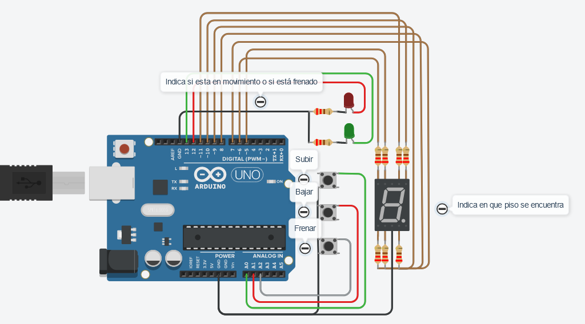

# Montacargas Funcional 
- [⚙ Funcionamiento del montacargas](#-funcionamiento-del-montacargas)
  - [Display 7 Segmentos](#display-7-segmentos)
  - [🚨 Informar en la consola](#-informar-en-la-consola)
  - [▶ Funciones Principales](#-funciones-principales)
- [Fuentes](#fuentes)

---



👉 [Link del Proyeto](https://www.tinkercad.com/things/2FAF5IW85vK?sharecode=BeQEQfDNB0thNgaBhFHiRQ6nalU1_J96uy39dtF20I0)

Este proyecto consiste en la implementación de un montacargas funcional como maqueta para un hospital. El montacargas puede recibir órdenes de subir, bajar o pausar, a travez de distintos pulsadores desde los diferentes pisos, y muestra el piso actual en un **display de 7 segmentos**.

El objetivo es simular el funcionamiento de un montacargas real dentro de un entorno controlado. El sistema debe contar con:

+ **3 pulsadores** (botones): uno para subir pisos, otro para bajar pisos y otro para detener el montacargas.
+ **2 LEDs**: uno verde que indica cuando el montacargas está en movimiento y otro rojo que indica cuando está pausado.
+ **Display de 7 segmentos**: muestra en tiempo real en qué piso se encuentra el montacargas.
+ Las resistencias necesarias para cada componente.

## ⚙ Funcionamiento del montacargas

Se implementa un algoritmo que permite que el montacargas suba y baje o se detenga al presionar los botones correspondientes.

- Los botones están conectados a pines analogicos del Arduino y se utilizan para recibir las órdenes de subir, bajar o pausar el montacargas.
- Los LEDs están conectados a pines digitales y se utilizan para indicar el estado del montacargas: verde para movimiento y rojo para pausa.
- El display de 7 segmentos está conectado a pines digitales y se utiliza para mostrar el piso actual del montacargas. Cada letra representa una luz del display.

```c++
#define BTN_FRENAR 16  // A2
#define BTN_BAJAR 15  // A1
#define BTN_SUBIR 14 // A0

#define LED_VERDE 13
#define LED_ROJO 12

#define a 11
#define b 10
#define c 9
#define d 8
#define e 7
#define f 5
#define g 6
```

Luego de definir cada componente conectado a la placa arduino declaro la variable `pisoActual` de tipo entero que representará en que piso se encuentra el montacargas. 

Dentro de `setup()` inicializo la variable en 0, que será el punto de partida.  
La función `Serial.begin()`  inicia la comunicación serial para poder utilizar las funciones `Serial.print()` y `Serial.println()` para imprimir datos a través del puerto serial(consola).

```c++
int pisoActual;

void setup()
{
  for (int i = 5; i <= 13; i++) {
    pinMode(i, OUTPUT);
  }
  pinMode(BTN_SUBIR, INPUT_PULLUP);
  pinMode(BTN_BAJAR, INPUT_PULLUP);
  pinMode(BTN_FRENAR, INPUT_PULLUP);

  Serial.begin(9600);
  pisoActual = 0;
}
```

Ademas, con el bucle for configuro los pines del display 7 segmentos y de los LEDs de colores como **salidas** y configuro los pulsadores como **entradas** con una resistencia **pull-up** interna habilitada.


Dentro del `loop` se verifica el estado de los botones utilizando la función `digitalRead`.

```c++
void loop()
{
  if (digitalRead(BTN_SUBIR) == LOW || digitalRead(BTN_BAJAR) == LOW) {
    PrenderLedVerdeRoja(true);
    SubirBajarPiso();
    PrenderLedVerdeRoja(false);
  }

  if (digitalRead(BTN_FRENAR) == LOW) {
    PrenderLedVerdeRoja(false);
  }
}
```

Si los botones **BTN_SUBIR** o **BTN_BAJAR** son presionados (LOW), se ejecutan las siguientes acciones:

- Se llama a la función `PrenderLedVerdeRoja` para encender el LED verde porque el montacargas está en movimiento.
- Se llama a la función `SubirBajarPiso` para realizar la función de subir o bajar un piso.
- Se llama a la función `PrenderLedVerdeRoja` nuevamente para encender el LED rojo porque al finalizar la funcion llega al ultimo piso y el montacargas queda frenado.

Además, si se detecta que el botón **BTN_FRENAR** está presionado , se llama a la función `PrenderLedVerdeRoja` para indicar que el montacargas no está en movimiento.

### Display 7 Segmentos

Cada letra dentro del **array** representa un led del display 7 segmentos.

```c++
void ApagarPrender7Segmentos(int apagarPrender)
{
  int segmentos[] = {a, b, c, d, e, f, g};

  for (int i = 0; i < 7; i++) {
    digitalWrite(segmentos[i], apagarPrender);
  }
} 
```

La funcion apaga o prende todos pines según el parametro recibido (HIGH o LOW). 

Esto me permite agilizar formar cada numero que deba mostrar con el display. Teniendo que unicamente encender u apagar los pines restantes para formar cada numero.

Por ejemplo, si deseo mostrar el numero 0, enciendo todos los LEDs del display y luego solo apago el LED `g`.

```c++
ApagarPrender7Segmentos(HIGH);
digitalWrite(g, LOW);
```

Incluí en la fución `CuentaRegresiva()` cada numero del display que forma el numero que recibe por parametro.

```c++
void CuentaRegresiva(int numero)
{
  switch (numero) {
    case 0:
      ApagarPrender7Segmentos(HIGH);
      digitalWrite(g, LOW);
      break;
      
    case 1:
      ApagarPrender7Segmentos(LOW);
      digitalWrite(b, HIGH);
      digitalWrite(c, HIGH);
      break;
      
    case 2:
      ApagarPrender7Segmentos(HIGH);
      digitalWrite(c, LOW);
      digitalWrite(f, LOW);
      break; //...
  }
}
```

### 🚨 Informar en la consola 

La funcion `ImprimirPiso()` recibe un numero entero que representa el piso actual en el que se encuentra el montacargas. E imprime por el monitor sereal "Estas en el piso: ...".

```c++ 
void ImprimirPiso(int piso) {
  Serial.print("Estas en el piso: ");
  Serial.println(piso);
}
```

La funcion `PrenderLedVerdeRoja()` recibe un booleano que representa actual del montacargas. Si está en movimiento (**true**) enciende el **LED verde** y apaga el LED rojo en caso de que esté encendido. Mientras que si el montacargas no se encuentra en movimiento (**false**) enciende el **LED rojo** y apaga el verde si está prendido.

```c++
void PrenderLedVerdeRoja(bool estaEnMovimiento){
  if (estaEnMovimiento){
    digitalWrite(LED_VERDE, HIGH);
    digitalWrite(LED_ROJO, LOW);
  }

  else {
    digitalWrite(LED_ROJO, HIGH);
    digitalWrite(LED_VERDE, LOW);    
  }
}
```

### ▶ Funciones Principales

El programa principal se divide en las siguientes funciones:

- **SubirBajarPiso**

```c++
void SubirBajarPiso() {
  if (digitalRead(BTN_SUBIR) == LOW) {
    SubirPiso();
  }
  else if (digitalRead(BTN_BAJAR) == LOW) {
    BajarPiso();
  }
}
```
La funcion ejecuta una funcion según que boton es presionado.

-  **SubirPiso** ⏫

```c++
void SubirPiso(){
  while(pisoActual < 10) {
    ImprimirPiso(pisoActual);
    CuentaRegresiva(pisoActual);
    delay(3000);
    pisoActual++;
  }
}
```

Esta función se ejecuta cuando se presiona el botón de subir piso. Aumenta el valor del piso actual y actualiza el display de 7 segmentos.
 
Si el montacargas estaba pausado, lo pone en movimiento y enciende el LED verde.
  
- **BajarPiso** ⏬

```c++
void BajarPiso(){
  while(pisoActual >= 0){
    ImprimirPiso(pisoActual);
    CuentaRegresiva(pisoActual);
    delay(3000);
    pisoActual--;
  }
}
```

Esta función se ejecuta cuando se presiona el botón de bajar piso. Decrementa el valor del piso actual y actualiza el display de 7 segmentos.

Si el montacargas estaba pausado, lo pone en movimiento y enciende el LED verde.

---
- El tiempo de trayecto entre pisos se establece en 3 segundos para simular el movimiento del montacargas.
- Mediante la comunicación con el monitor serial, se informa el piso en el que se encuentra el montacargas.
---

## Fuentes

➡ [Display 7 segmentos](https://www.electrontools.com/Home/WP/display-7-segmentos/)

---

Si deseas contribuir a este proyecto, no dudes en enviar un pull request o abrir un issue en GitHub.