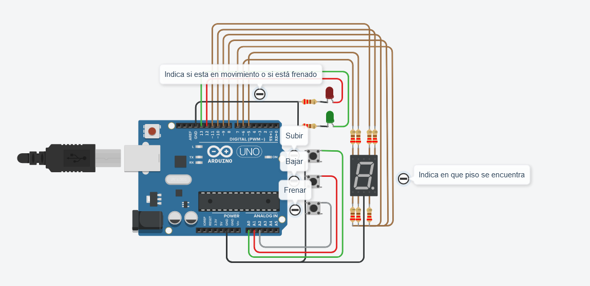

# Montacargas Funcional
- [⚙ Funcionamiento del montacargas](#-funcionamiento-del-montacargas)
- [⌨ Documentación del Código](#-documentación-del-código)
  - [↕ Controles de desplazamiento ascendente/descendente](#-controles-de-desplazamiento-ascendentedescendente)
  - [⏯ Botón de Freno](#-botón-de-freno)
  - [🚨 Informar por consola](#-informar-por-consola)
  - [🕹️ Display 7 Segmentos](#️-display-7-segmentos)
- [📚 Fuentes](#-fuentes)

---



👉 [Link del Proyecto](https://www.tinkercad.com/things/3Vj7uDJXAMC)

Este proyecto consiste en la implementación de un montacargas funcional como maqueta para un hospital. El montacargas puede recibir órdenes de subir, bajar o pausar, a través de distintos pulsadores desde los diferentes pisos, y muestra el piso actual en un **display de 7 segmentos**.

El objetivo es simular el funcionamiento de un montacargas real dentro de un entorno controlado. El sistema debe contar con:

+ **3 pulsadores** (botones): uno para subir pisos, otro para bajar pisos y otro para detener el montacargas.
+ **2 LEDs**: uno verde que indica cuando el montacargas está en movimiento y otro rojo que indica cuando está pausado.
+ **Display de 7 segmentos**: muestra en tiempo real en qué piso se encuentra el montacargas.
+ Las resistencias necesarias para cada componente.

🔗 [Modelo Esquematico](assets\Modelo_Esquematico.pdf)  
📑 [Lista de componentes](assets\Lista_De_Componentes.csv)


## ⚙ Funcionamiento del montacargas

Se implementa un algoritmo que permite que el montacargas suba y baje o se detenga al presionar los botones correspondientes.

- Los botones están conectados a pines analógicos del Arduino y se utilizan para recibir las órdenes de subir, bajar o pausar el montacargas.
- Los LEDs están conectados a pines digitales y se utilizan para indicar el estado del montacargas: verde para movimiento y rojo para pausa.
- El display de 7 segmentos está conectado a pines digitales y se utiliza para mostrar el piso actual del montacargas. Cada letra representa una luz del display.

El circuito comienza una vez que se pulsa el botón de freno. Te indica que se encuentra en el piso cero. Al presionar el botón de subir/bajar va hacia a la dirección designada y muestra tanto en monitor serial como en el display 7 segmentos en que piso se encuentra.

## ⌨ Documentación del Código

Empezamos definiendo cada uno de los componentes conectados a la placa arduino.

```c++
#define BOTON_FRENAR 16  // A2
#define BOTON_BAJAR 15  // A1
#define BOTON_SUBIR 14 // A0

#define LED_VERDE 13
#define LED_ROJO 12

#define a 11
#define b 10
#define c 9
#define d 8
#define e 7
#define f 5
#define g 6
```

Luego declaro dos variables:

- `pisoActual` de tipo entero que representará en qué piso se encuentra el montacargas. Se inicializa en 0, ya que ese será el punto de partida.  
- `estaEnMovimiento` que mediante un dato booleano representará el estado en el que se encuentre el montacargas.

```c++
int pisoActual = 0;
bool estaEnMovimiento = false;
```

---

La función `Serial.begin()`  inicia la comunicación serial para poder utilizar las funciones `Serial.print()` y `Serial.println()` para imprimir datos a través del puerto serial/consola.

```c++
void setup()
{
  for (int i = 5; i <= 13; i++) {
	pinMode(i, OUTPUT);
  }

  pinMode(BOTON_SUBIR, INPUT_PULLUP);
  pinMode(BOTON_BAJAR, INPUT_PULLUP);
  pinMode(BOTON_FRENAR, INPUT_PULLUP);
  Serial.begin(9600);
}
```

Además, con el bucle for configuro los pines del display 7 segmentos y de los LEDs de colores como **salidas** y mientras que configuró los pulsadores como **entradas** con una resistencia **pull-up** interna habilitada.

---

Dentro del bucle `loop` se verifica el estado de los botones utilizando la función `digitalRead`.

```c++
void loop()
{
  if (digitalRead(BOTON_SUBIR) == LOW) {
	controlarMontacargas("Subir");
  }
  if (digitalRead(BOTON_BAJAR) == LOW) {
	controlarMontacargas("Bajar");
  }
  if (digitalRead(BOTON_FRENAR) == LOW) {
	frenarMontacargas();
  }
}
```

### ↕ Controles de desplazamiento ascendente/descendente

Si los botones **BOTON_SUBIR** o **BOTON_BAJAR** son presionados (LOW) se controla el montacargas según el botón presionado solamente si se encuentra en funcionamiento.

```c++
void controlarMontacargas(String modo)
{
  if (estaEnMovimiento) {
	encenderluzDeMovimiento(estaEnMovimiento);
	delay(3000);

	if (modo == "Subir") {
  	[](){(pisoActual < 9) ? pisoActual++ : estaEnMovimiento == false;}();
	} else if (modo == "Bajar") {
  	[](){(pisoActual > 0) ? pisoActual-- : estaEnMovimiento == false;}();
	}

	informarEstado(pisoActual);
	encenderluzDeMovimiento(false);
  }
}
```

- Se llama a la función `encenderluzDeMovimiento` para encender el LED mientras el montacargas se encuentre en movimiento (3 seg).
- Si el modo se establece en **"subir"**, incrementa de piso hasta llegar al piso máximo (9).
- Si el modo se establece en **"bajar"**, baja de piso hasta llegar al piso base (0).

Además informa en qué piso se encuentra y pasado el intervalo de movimiento enciende la luz roja hasta que se vuelva a cambiar de piso.

### ⏯ Botón de Freno

El botón de freno permite detener el montacargas desde cualquier piso y solamente te dejará moverte de piso tras volverlo a presionar.

```c++
void frenarMontacargas()
{
  informarEstado(pisoActual);
  (!estaEnMovimiento) ? estaEnMovimiento = true : estaEnMovimiento = false;
  delay(100);
}
```
La función muestra en qué piso se encuentra en el momento que se frena. También cambia el estado de movimiento del montacargas (si no estaba en movimiento, lo pone en movimiento, y viceversa).
El delay es para evitar el rebote del loop y se ejecute varias veces al ser presionado una única vez.

### 🚨 Informar por consola

`informarEstado` recibe un número entero que representa el piso actual en el que se encuentra el montacargas y se lo pasa a la función `ImprimirPiso` que muestra por el monitor serial un mensaje. Y muestra dicho número en el display 7 segmentos a través de la función [`CuentaRegresiva`](#🕹️-display-7-segmentos)

```c++
void informarEstado(int piso)
{
  ImprimirPiso(piso);
  CuentaRegresiva(piso);
}

void ImprimirPiso(int piso)
{
  Serial.print("Estás en el piso: ");
  Serial.println(piso);
}

void encenderluzDeMovimiento(bool prendeApaga)
{
  if (prendeApaga) {
	digitalWrite(LED_VERDE, HIGH);
	digitalWrite(LED_ROJO, LOW);
  } else if (!prendeApaga) {
	digitalWrite(LED_ROJO, HIGH);
	digitalWrite(LED_VERDE, LOW);    
  }
}
```

La función `encenderluzDeMovimiento()` recibe un booleano que representa el estado actual del montacargas. Si está en movimiento (**true**) enciende el **LED verde** y apaga el LED rojo. Mientras que si el montacargas no se encuentra en movimiento (**false**) enciende el **LED rojo** y apaga el verde.

### 🕹️ Display 7 Segmentos

Cada letra dentro del **array** representa un led del display 7 segmentos.

```
    A
   ---
F |   | B
  | G |
   ---
E |   | C
  |   |
   ---
    D
```

```c++
void ApagarPrender7Segmentos(int apagarPrender)
{
  int segmentos[] = {a, b, c, d, e, f, g};
  for (int i = 0; i < 7; i++) {
	digitalWrite(segmentos[i], apagarPrender);
  }
}
```

La función apaga o prende todos pines según el parámetro recibido (HIGH o LOW).

Esto me permite agilizar formar cada número que deba mostrar con el display. Teniendo que únicamente encender u apagar los pines restantes para formar cada número.

Por ejemplo, si deseo mostrar el número 0, enciendo todos los LEDs del display y luego solo apago el LED `g`.

```c++
ApagarPrender7Segmentos(HIGH);
digitalWrite(g, LOW);
```

Incluí en la función `CuentaRegresiva()` cada número del display que forma el número que recibe por parámetro.

```c++
void CuentaRegresiva(int numero)
{
  switch (numero) {
	  case 0:
    	ApagarPrender7Segmentos(HIGH);
    	digitalWrite(g, LOW);
    	break;
	  case 1:
    	ApagarPrender7Segmentos(LOW);
    	digitalWrite(b, HIGH);
    	digitalWrite(c, HIGH);
    	break;
	  case 2:
    	ApagarPrender7Segmentos(HIGH);
    	digitalWrite(c, LOW);
    	digitalWrite(f, LOW);
    	break;
	  case 3:
    	ApagarPrender7Segmentos(HIGH);
    	digitalWrite(e, LOW);
    	digitalWrite(f, LOW);
    	break;
	  case 4:
    	ApagarPrender7Segmentos(HIGH);
    	digitalWrite(a, LOW);
    	digitalWrite(d, LOW);
    	digitalWrite(e, LOW);
    	break;
	  case 5:
    	ApagarPrender7Segmentos(HIGH);
    	digitalWrite(b, LOW);
    	digitalWrite(e, LOW);
    	break;
	  case 6:
    	ApagarPrender7Segmentos(HIGH);
    	digitalWrite(b, LOW);
    	break;
	  case 7:
      ApagarPrender7Segmentos(HIGH);
    	digitalWrite(g, LOW);
    	digitalWrite(d, LOW);
    	digitalWrite(e, LOW);
      break;
    case 8:
    	ApagarPrender7Segmentos(HIGH);
    	break;
    case 9:
    	ApagarPrender7Segmentos(HIGH);
    	digitalWrite(e, LOW);
    	break;
  }
}
```

## 📚 Fuentes

➡ [Electrontools](https://www.electrontools.com/Home/WP/display-7-segmentos/)  
➡ [Arduino Project Hub](https://projecthub.arduino.cc)     
➡ [Aprendiendo Arduino](https://aprendiendoarduino.wordpress.com/tag/funciones-lambda/)

---

Si deseas contribuir a este proyecto, no dudes en enviar un pull request o abrir un issue en GitHub.
